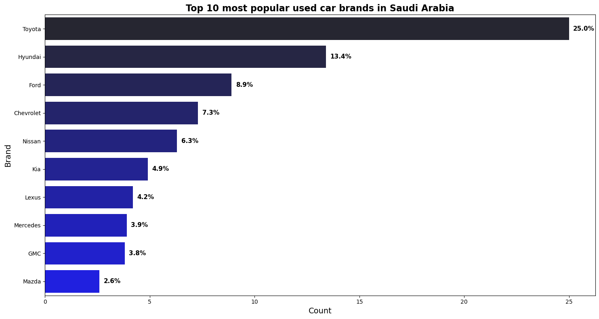
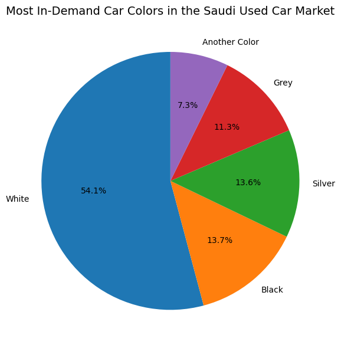
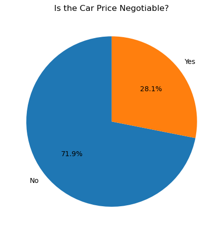
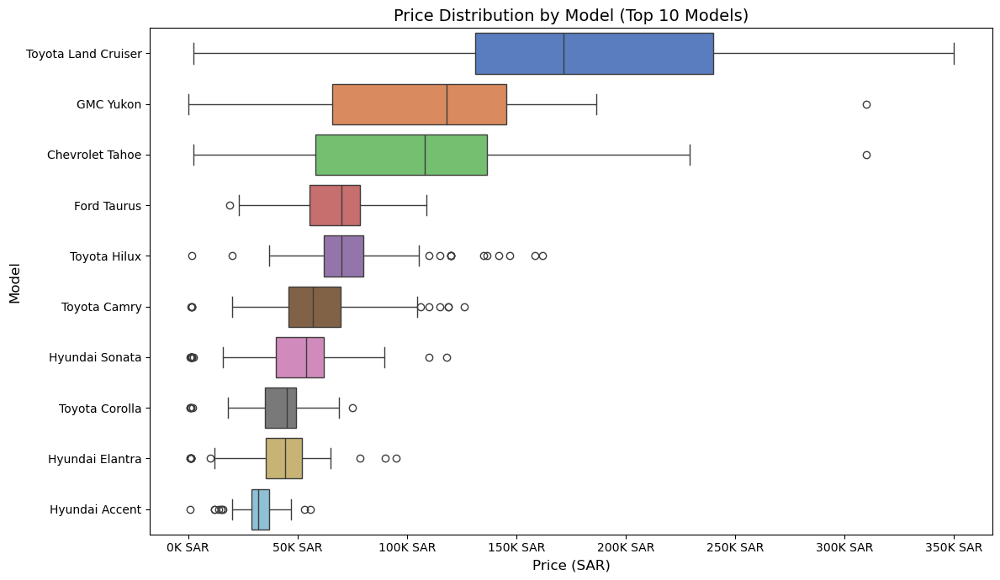
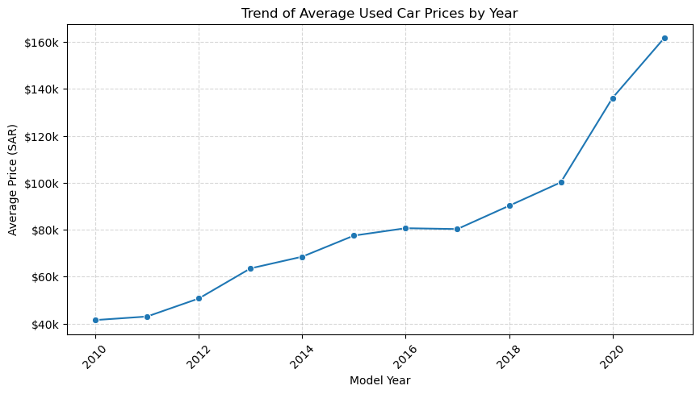
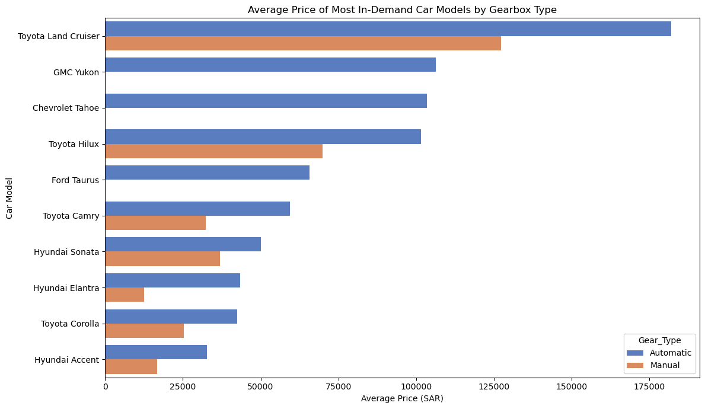
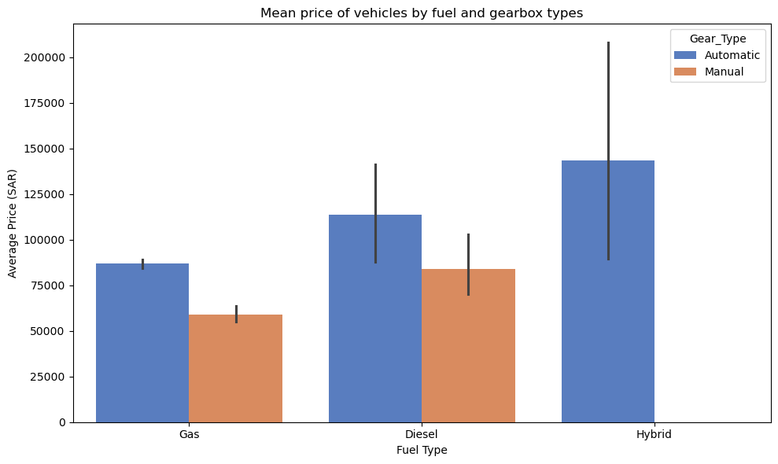

# Saudi Arabia Used Cars Analysis

## Overview

This project analyzes the used car market in Saudi Arabia, focusing on market trends, pricing, and vehicle characteristics.  
The aim is to provide insights into popular brands, vehicle preferences, price trends, and customer behavior in the used car market.

## Dataset:

The dataset, "Saudi Arabia Used Cars Dataset", contains information on used car listings in Saudi Arabia. It includes columns such as brand, model, year of manufacture, mileage, price, fuel type, gearbox type, color, and location. The data is publicly available on Kaggle: [Dataset Link](https://www.kaggle.com/code/elgohary249/saudi-arabia-used-cars-dataset/input)

---

## The questions

This project analyzes the used car market in Saudi Arabia, focusing on market trends, pricing, and vehicle characteristics. The following questions guide the analysis:

### Market Overview

1. What are the top 10 most popular used car brands in Saudi Arabia?
2. What are the most in-demand car colors?
3. What proportion of used cars have negotiable prices?

### Pricing Analysis

4. What is the price variation among the most in-demand used car models in Saudi Arabia?
5. What is the trend of used car prices over the years?

### Vehicle Characteristics & Usage

6. Which vehicles tend to have higher mileage by year?
7. What is the average vehicle price for the most in-demand car models by gearbox type?
8. What is the average vehicle price by fuel type and gearbox type?

## Python Libraries Used :

- Pandas
- Numpy
- Seaborn
- Matplotlib

## The Analysis

Check out the project [here](used_cars_SA.ipynb)

## 1. What are the top 10 most popular used car brands in Saudi Arabia?

**Insight:**

The most popular used car brands in Saudi Arabia are dominated by Toyota and Hyundai, reflecting strong consumer preference for reliability and affordability.

### 2. What are the most in-demand car colors?

**Insight:**

White ranks as the most preferred color among used car buyers in Saudi Arabia, followed by black and silver, reflecting cultural preferences and practical considerations such as heat resistance and resale value.

### 3. What proportion of used cars have negotiable prices?

**Insight:**  
Most used car listings have fixed prices, with only a smaller portion offering negotiable pricing, indicating a relatively structured pricing behavior in the Saudi used car market.

### 4. What is the price variation among the most in-demand used car models in Saudi Arabia?

**Insight:**  
There is significant variation in price across brands and even within the same brand, driven by differences in vehicle models and specifications.

### 5. What is the trend of used car prices over the years?

**Insight:**

Used car prices vary across production years, with newer vehicles generally commanding higher prices.

### 6. Which vehicles tend to have higher mileage by year?

**Insight:**
Older vehicles tend to have higher mileage, while newer vehicles generally show lower accumulated mileage.

### 7. What is the average vehicle price for the most in-demand car models by gearbox type?

**Insight:**

Automatic cars are priced higher across most popular models, while manual versions appear less frequently, reflecting lower demand in the Saudi used car market.

### 8. What is the average vehicle price by fuel type and gearbox type?

## Insight:

Gasoline vehicles with automatic transmission tend to have the highest average prices.

## Conclusion

This analysis highlights key price drivers in the Saudi used car market, including year, mileage, engine size, and region.
It also reflects a strong market preference for Japanese vehicles due to their reliability and widespread availability of spare parts.
Overall, the insights support data-driven decisions that help buyers make more confident and cost-effective purchases.
